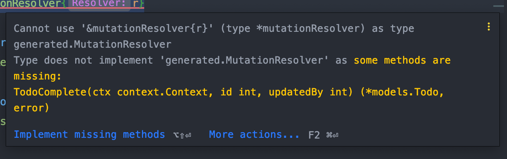

<p align="center">
  
  <h3 align="center">GQLGen PG TODO Example</h3>
  <p align="center">A simple, no fuss, example thats updated regularly to stay current with the API landscape</p>
</p>

# Introduction

This project is intended to help newcomers to gqlgen and GraphQL. This isn't meant to be the ONLY way you should organize and build your application. I took extensively liberties here to minimize func calls and writing helper wrappers which do nothing more than confuse newcomers.

# Setup

1. **Install [Go 1.13 or greater](https://dl.google.com/go/go1.13.darwin-amd64.pkg)**.
   - The recommended approach is to use the installer to get started.
2. **Install Postgres**
   - This varies depending on the environment that you're on and I don't intend for this repository to list the steps necessary to install pg.
3. **Ensure that you have a `todos`** database created
   - There's a makefile step already available, `make init` which will create the database if it doesn't already exist
4. **Start the magic by running the following command**
   - `go run main.go`

# Updating GraphQL Models + CodeGen

The application uses ([GQLGEN](https://gqlgen.com)) to generate statically typed bindings for all of the grahql models.

1. Generate the Go model that represents the graph model. An example looks like the following:

```go
package models

import (
	"time"
)

// User Graph datamodel
type User struct {
	ID     string `json:"id"`
	Email  string `json:"email"`

	FirstName   string `json:"firstName"`
	LastName    string `json:"lastName"`

	CreatedAt     time.Time `json:"createdAt"`
	UpdatedAt     time.Time `json:"updatedAt"`
}

```

2. Add/Update your model in the `/schema` folder of the application. An example looks like the following. Note that you must reference the graph model package with the `@goModel` directive.

```graphql
type User
  @goModel(
    model: "github.com/oshalygin/gqlgen-pg-todo-example/models/models.User"
  ) {
  id: ID!
  email: String!

  firstName: String!
  lastName: String!

  createdAt: Time!
  updatedAt: Time!
}
```

3. Run the codegen process

```bash
make gen
```

4. Implement the resolver within the resolvers package.

# Generating Dataloaders

```bash
# Run the following commands to generate dataloaders
# This command will place a codegen dataloader in the graph/generated folder
# Note that the loader argument is required and the value is case sensitive
make dataloader loader=User
```

You must still create the appropriate dataloader in the codebase to support
the generated implementation.

```go

// Create the loader that resembles other loaders in the dataloaders package
// This is merely an example

func User(db *pg.DB, w http.ResponseWriter, r *http.Request, next http.Handler) {
	loader := generated.NewUserLoader(generated.UserLoaderConfig{
		MaxBatch: 100,
		Wait:     1 * time.Millisecond,
		Fetch: func(keys []int) ([]*models.User, []error) {

			var dbUsers []*models.User
			// This query does NOT return an array that matches the order of the IN
			// clause.  Meaning: SELECT * FROM Users where id IN (1,8,3)
			// will not return users 1, 8, 3 in that order.  This order is VERY important
			// as that is how the dataloaden library resolves and matches objects.  Note the ids here are collected via
			// goroutines and the order is not going to be nicely ordered to match your DB
			// result query.  Try adding a breakpoint here and looking at the arg(keys) and the
			// resulting array from the following where query.
			err := db.Model(&dbUsers).WhereIn("id IN (?)", keys).Select()

			if err != nil {
				return []*models.User{}, []error{err}
			}

			// All we're doing here on out is just ordering our
			// collection to match the argument keys []int collection
			userKeys := make(map[int]*models.User)
			users := make([]*models.User, len(keys))

			for _, user := range dbUsers {
				userKeys[user.ID] = user

			}

			for i, k := range keys {
				if user, ok := userKeys[k]; ok {
					users[i] = user
				}
			}

			return users, []error{err}
		},
	})

	ctx := context.WithValue(r.Context(), UserLoader, loader)
	next.ServeHTTP(w, r.WithContext(ctx))
}


// Add a new entry in the NewMiddleware function

func NewMiddleware(session *mgo.Session) []func(handler http.Handler) http.Handler {
	return []func(handler http.Handler) http.Handler{
		setLoader(session, User),
    // setLoader(session, YourLoader)
	}
}

```

Note if you're going to use the make script for dataloader creation, you may consider extending it to take something other than an int for the key(in the case of uuid keys)

# Resolvers

The first step before adding a resolver is to define a new mutation/query or property in your GQL Schema. For example:

```graphql
todoCreate(todo: TodoInput!): Todo!
```

Ensure that you actually have a `TodoInput` input type defined:

```graphql
input TodoInput
  @goModel(
    model: "github.com/oshalygin/gqlgen-pg-todo-example/models.TodoInput"
  ) {
  name: String!
  createdBy: Int!
}
```

Run the code gen:

```bash
make gen
# or
go generate ./...
```

Depending on what you added you will now get compiler errors in the file `resolvers.go`.  What you see depends on your terminal output or your IDEA.  Here are some examples of unimplemented code:



```bash
# github.com/oshalygin/gqlgen-pg-todo-example/resolvers
resolvers/resolver.go:14:27: cannot use &mutationResolver literal (type *mutationResolver) as type generated.MutationResolver in return argument:
	*mutationResolver does not implement generated.MutationResolver (missing TodoComplete method)
```

# Sample Queries

```graphql
query {
  users {
    id
    email
    firstName
    lastName
  }
}
```

```graphql
query {
  user(id: 1) {
    id
    email
    firstName
    lastName
  }
}
```

```graphql
mutation {
  userCreate(
    user: {
      email: "gandalf@gmail.com"
      firstName: "Gandalf"
      lastName: "Wizard"
    }
  ) {
    id
    email
    firstName
    lastName
    createdAt
  }
}
```

```graphql
query {
  todo(id: 1) {
    id
    name
    isComplete
    isDeleted
    createdAt
    updatedAt
    createdBy {
      firstName
      lastName
    }
  }
}
```

```graphql
query {
  todos {
    id
    name
    isComplete
    createdBy {
      firstName
      lastName
      email
    }
  }
}
```

```graphql
mutation {
  todoComplete(id: 1, updatedBy: 2) {
    id
    name
    isComplete
    isDeleted

    createdBy {
      firstName
    }

    updatedBy {
      firstName
    }

    createdAt
    updatedAt
  }
}
```

# Dependencies

| **Tech**                                      | **Description**                                                                                                              |
| --------------------------------------------- | ---------------------------------------------------------------------------------------------------------------------------- |
| [gqlgen](https://github.com/99designs/gqlgen) | `gqlgen` is a Go library for building GraphQL servers without any fuss.                                                      |
| [color](https://github.com/fatih/color)       | Colorizes text. Who doesn't like colorful stdout?                                                                            |
| [go-chi](github.com/go-chi/chi)               | This is an http router. Pick your flavor, this is mine.                                                                      |
| [go-pg](github.com/go-pg/pg/v9)               | This is our fancy Go Postgre ORM. You could write raw SQL queries if you wanted to, but I rather not for this sample project |
| [yacspin](github.com/theckman/yacspin)        | A nice and simple terminal spinner used during seed steps                                                                    |

# License

MIT
